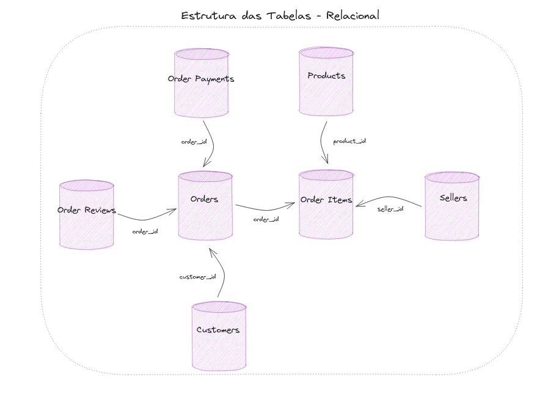
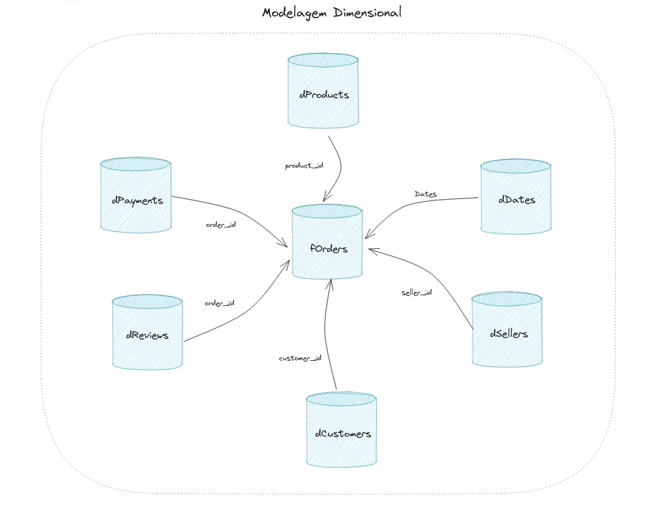
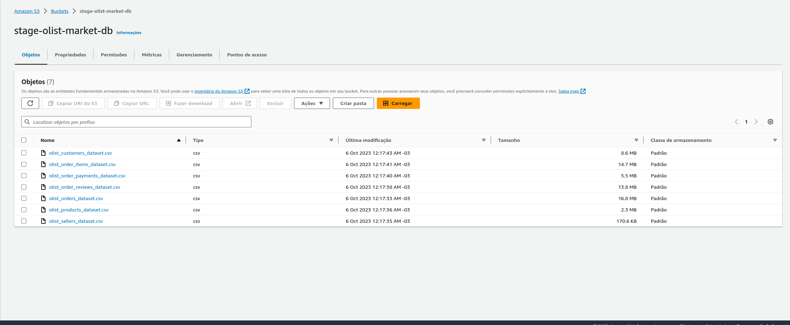
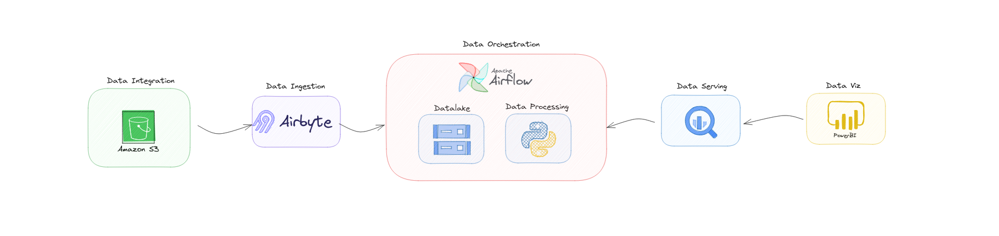
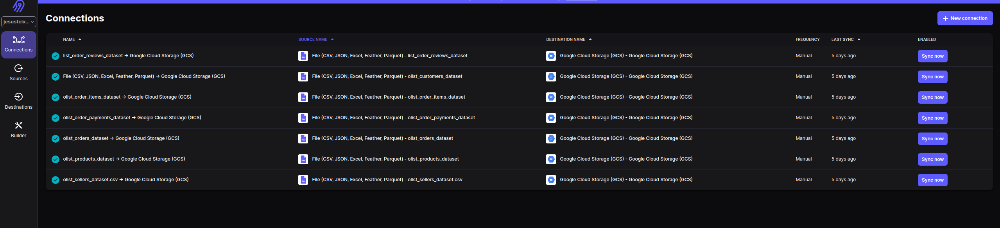
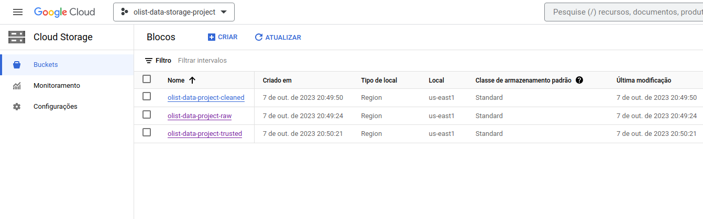
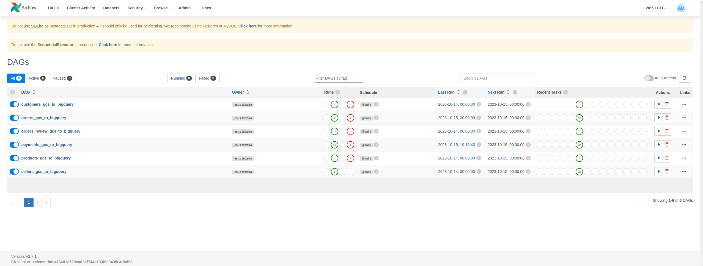
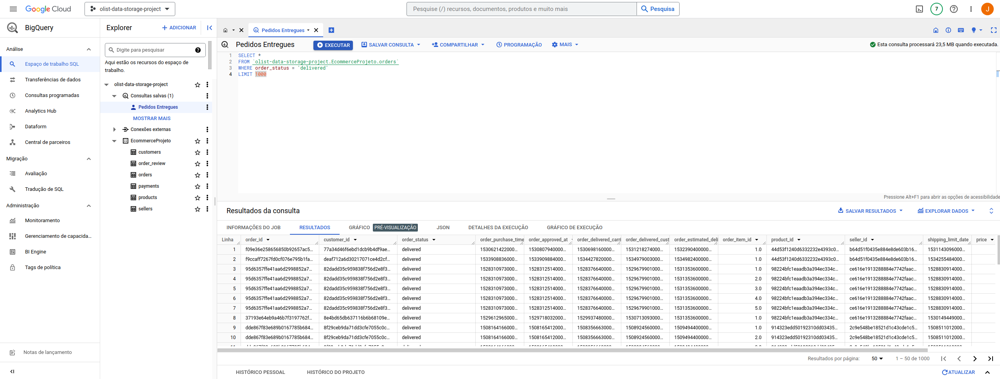
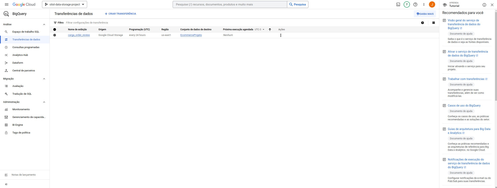

# Pipeline de Dados - Olist Database 
<b>Alerta:</b> Os dados utilizados nesse projeto estão disponíveis no keggle neste link: https://www.kaggle.com/datasets/olistbr/brazilian-ecommerce .   
# Construção de um pipeline de dados
Neste projeto quis experimentar o processo de criação de um pipeline de dados que vai desde a extração dos dados na camada de integração de um sistema OLTP até a disponibilização deste dado no modelo estrela dentro de um Modern Data Warehouse. Neste projeto Utilizei as seguintes ferramentas: s3, airbyte, airflow, google cloud storage, python, google data transfer e Big Query. 
  

## 1. Sobre a Olist
O Ecommerce Olist é uma plataforma de comércio eletrônico brasileira que permite que vendedores ofereçam produtos em diversos marketplaces, simplificando a gestão de pedidos e fornecendo visibilidade em toda a cadeia de suprimentos.
  

### 1.1. Sobre o Projeto
O projeto tem como objetivo a transformação dos dados da estrutura OLTP do sistema de origem em um modelo estrela, utilizando um pipeline de dados otimizado. Esses dados serão então disponibilizados em um Modern Data Warehouse para permitir que as áreas de negócios os consumam de maneira analítica, fornecendo insights valiosos.

Estrutura Inicial:

    

Estrutura Desejada:

    

Obs: Cada uma das tabelas é representada por um banco de dados no diagrama. No entanto, é importante observar que cada objeto na verdade é uma tabela, não em um banco de dados. O uso do banco no diagrama foi somente para representar a interação de cada tabela (chaves e relacionamentos).
  

### 1.2. Problema de Negócio
A equipe de TI implementou com sucesso uma rotina automatizada para extrair diariamente dados de um banco de dados relacional e disponibilizá-los como arquivos CSV em um bucket no Amazon S3. Minha responsabilidade como Engenheiro de Dados é criar o pipeline de dados e realizar a ingestão desses dados no BigQuery.

Bases no S3:

    

  

## 2. Arquitetura do Pipeline
  

    

 

### 2.1. Ingestão de Dados - Airbyte
A ferramenta escolhida para fazer a ingestão de dados do Amazon S3 para o Google Cloud Storage foi o Airbyte, conforme imagem abaixo.

    

O processo de implantação e configuração do Airbyte é notavelmente simples. Basta selecionar uma fonte de dados e um destino, e em seguida, configurar a conexão, incluindo a definição da periodicidade para a carga de dados. 

  

### 2.2. Datalake - Google Cloud Storage
Dentro do datalake foi criado 3 camadas: raw, cleaned e trusted. 
Na camada raw estão armazenados os dados brutos, está é a camada onde ocorre a ingestão de dados do airbyte. A camada cleaned serve para armazenar dados limpos que podem ter passado por um ou mais das seguintes etapas de tratamento, limpar nulos, alterar tipo de dados, remoção de colunas, e etc. Os dados estarão na camada trusted após passar algumas regras para enriquecimento do dados, criação de novas colunas, flags e aplicação de regras de negócios, quando necessaŕio.
  

    

### 2.3. Orquestração - Apache Airflow + Python
O processo de orquestração serve para automatizar essa etapa do pipeline de dados. Cada DAG dentro do projeto tem como objetivo fazer com que os dados saiam da camada raw até e chegem na camada trusted do Datalake. Dentro desse processo foi utilizado diversos operadores e transfers do Google Cloud no Airflow como por exemplo: GCSToLocalFilesystemOperator, LocalFilesystemToGCSOperator, GCSToGCSOperator, PythonOperator, BashOperator e EmptyOperator. Além disso utilizei algumas bibliotecas como datetime e pandas para processar os dados em cada uma das etapas.

Web UI do Airflow com as DAG das dimensões e da fato:

    

Para acessar o código de cada uma das Dags criadas use esse link: https://github.com/Jesus-Teixeira-DS98/olist_pipeline_gcs_bigquery/tree/main/dags
  

### 2.4. Data Serving - Big Query 
Ao disponibilizar os dados na camada trusted do Datalake esses dados são transferidos para o Big Query por meio do Data Transfer do Big Query. Ao disponibilizar os dados dento do MDW solicitado o pipeline de dados está completo e pode ser consumido por ferramentas de Dataviz como Power BI, Looker e etc.
  

Dados dentro das tabelas no Big query:

    

Camada de Transferência:

    

## 3. Lições Aprendidas
- Uso de Excalidraw para desenhar e planejar meus projetos;
- Provisionamento de Storages (Datalake) na AWS e GCP;
- Configuração de Conexões do airflow por meio de chaves json;
- Uso de Transfers e Operadores do Provider Google Cloud do Airflow;
- Deploy Local do Airflow;
- Usar Logs da Web UI do airflow para monitorar falhas de Dags;
- Como fazer o Deploy local e configurar fontes e destinos no Airbyte;
- Como criar tabelas e transferir dados para o Big Query;
- Como salvar Consultas no Big Query; 
- Como particionar tabelas para otimizar custo do Big Query.
  

## 4. Próximos Passos
- Desenvolver Dashboard no PBI para incluir a camada de Dataviz;
- Finalizar Transfer do Big Query;
- Fazer o Deṕloy do Airbyte e Airflow dentro de uma máquina Virtual;
- Usar Taskflow API do Airflow para modernizar o código.
  